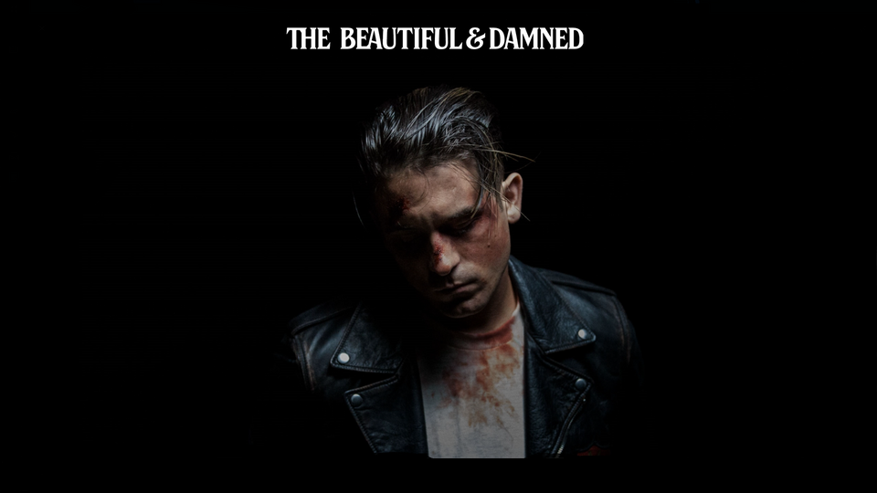
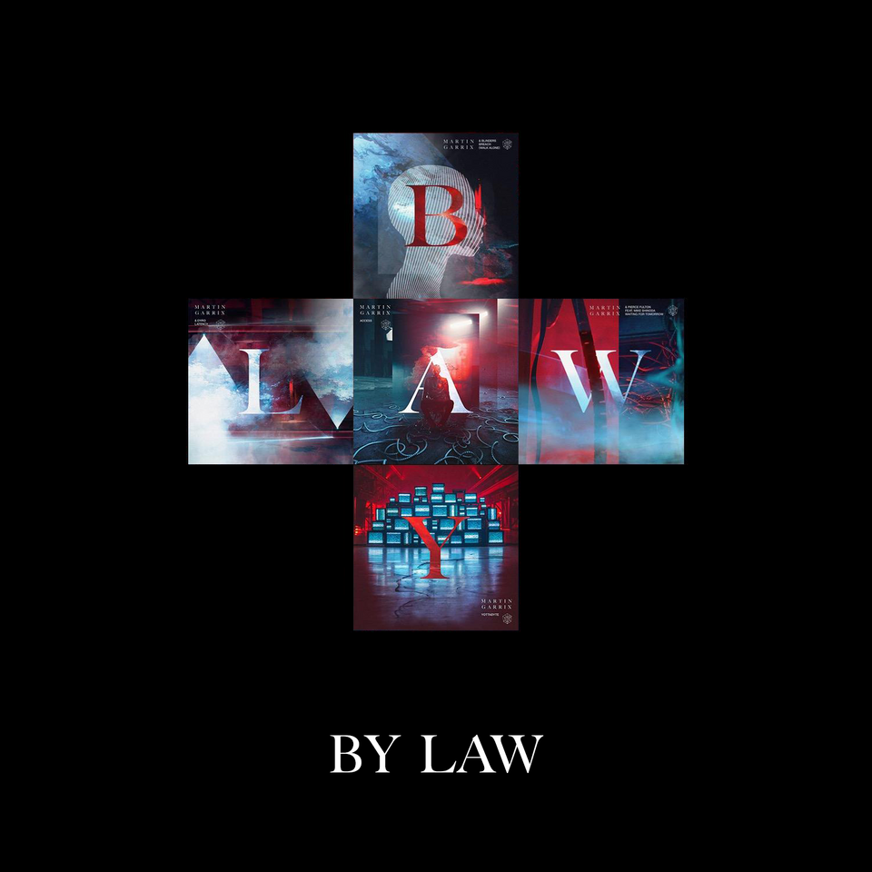

# ezratunuka.github.io

<!doctype html>
<html lang="en-us">
<head>
  <meta charset="UTF-8">
  <meta http-equiv="X-UA-Compatible" content="IE=Edge">
  <meta name="viewport" content="width=device-width, initial-scale=1, shrink-to-fit=yes">
    <link rel="stylesheet" href="master.css">
    <link rel="stylesheet" href="css/bootstrap.css">
    <link rel="icon" type="image" href="logo.jpg">
    <link rel="stylesheet" href="https://maxcdn.bootstrapcdn.com/bootstrap/3.3.5/css/bootstrap.min.css">
    <link rel="stylesheet" href="https://maxcdn.bootstrapcdn.com/font-awesome/4.4.0/css/font-awesome.min.css">
  <title>Music Visor &reg;</title>
</head>
<body>
<nav>

    
<ul class="navbar-dark nav align-content-center">
    <a class="active list-group-item" href="home.html">Home</a>
    <a class=" active list-group-item"href="#news">News </a>
    <a class=" active list-group-item"href="about.html">About </a>
    <form class="form-inline">
        

            <input type="text" placeholder="Search Bar">
            <button type="button" class="btn"> <i class="fa fa-search text-muted ">
            </i></button>
        

    </form>
    </ul>
     
    <ul class="navbar-dark nav ">
        <a class="active list-group-item" href="albums.html">Albums</a>
        <a class=" active list-group-item"href="https://www.google.com/search?q=new+music+spotify&rlz=1C1CHWL_enKE669KE669&oq=new+music+spotif&aqs=chrome.0.0j69i57j0l4.4269j0j4&sourceid=chrome&ie=UTF-8">New singles</a>
        <a class=" active list-group-item"href="https://www.youtube.com/watch?v=ksX_Xkf3Ryg">Song of the week</a>
        <a class="active list-group-item" href="https://www.youtube.com/watch?v=JxzKNHfNRdI">Video of the week</a>
    </ul>

</nav>
 

        <h1 class="jumbotron-fluid"> Welcome to</h1>
    <h2 class="jumbotron-fluid">Music Visor &reg; </h2>

  

    <H1 class="jumbotron center">Sign In</H1>
<form action="">

<label for="name">Username: </label>
  <input type="text" name="Username" id="name">

<label for="password">Password: </label>
  <input type="password" name="password" id="password">

  <a class="btn btn-primary" href="home.html" role="button">Submit</a>

</form>
  

<section>
    

        

            

            

        

    

</section>

<section>
    

        

            

<h1 id="news" class="text-center">News</h1>
                

                    <ol class="carousel-indicators">
                        <li data-target="#myCarousel" data-slide-to="1" class="active"></li>
                        <li data-target="#myCarousel" data-slide-to="2"></li>
                    </ol>
                    

                        

                            
                        

                        

                            
                        

                    

                

            

            

                

                  

                      <h1>The Beautiful and the Damned</h1>
                  

                    
The album's cover art and release was released on November 8, 2017. A short film is set to accompany the album on its release date. The film was directed by Bobby Bruderle alongside G-Eazy, who co-wrote it and will be released as an Apple Music exclusive. In an interview with Angie Martinez, he revealed the album's concept.
The concept of it is kinda split in half and it's two CDs, but for all intents and purposes its 20 songs, it's just a long album," he explained. "The concept of it is kinda like its about the lifestyle, 'The Beautiful and Damned'. Like being a kid, having the dream of doing this, starting from square one, from outside looking in from without having nothing -- to chasing this dream, and then all these years down the road of following this yellow brick road trying to get to where you're going, one day waking up and being like, 'Did it take me where I wanted to go?' This fantasy of, like, sex, drugs, & rock 'n' roll is kinda clichéd, but it's clichéd for a reason. It's dark."

    

        

    

</section>

    

      

          <h1>By Law</h1>
      

      
Bylaw(alternatively Bylaw EP; stylised in all caps) is the third EP by Dutch DJ Martin Garrix The EP was released in five parts, with a song being released each day from 15 to 19 October before being released in full on 19 October 2018, similar to the release schedule of Garrix's previous EP Seven. The EP features collaborations with Blinders, Dyro, Pierce Fulton, and Linkin Park singer Mike Shinoda. Details of the releases were initially leaked and thought to be rumours based off Garrix's website being updated, until Garrix confirmed the details through his Twitter. The first track, "Breach (Walk Alone)" with Blinders, was released on 15 October 2018. "Yottabyte", "Latency", "Access" and "Waiting for Tomorrow" followed on 16, 17, 18 and 19 October 2018, respectively.

<footer>

	

		

			

				

					

Follow Us:

					<ul class="list-group-item link-list">
						<li><a href="https://www.facebook.com/"> <i class="fa fa-facebook"></i> Facebook</a>

            </li>
						<li><a href="https://twitter.com/"> <i class="fa fa-twitter"></i> Twitter</a>

            </li>
						<li><a  href="https://www.instagram.com/?hl=en"> <i class="fa fa-instagram"> Instagram</i></a>

            </li>
                        <li><a  href="https://www.youtube.com/"> <i class="fa fa-youtube"> Youtube </i></a>

                        </li>
					</ul>
				

			

		

	

</footer>

</body>

</html>
